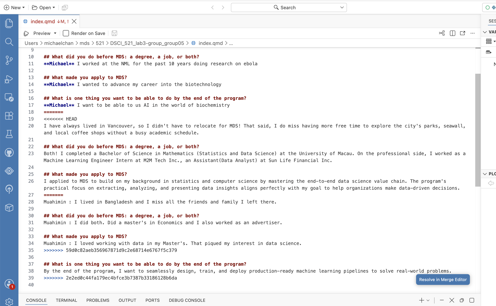
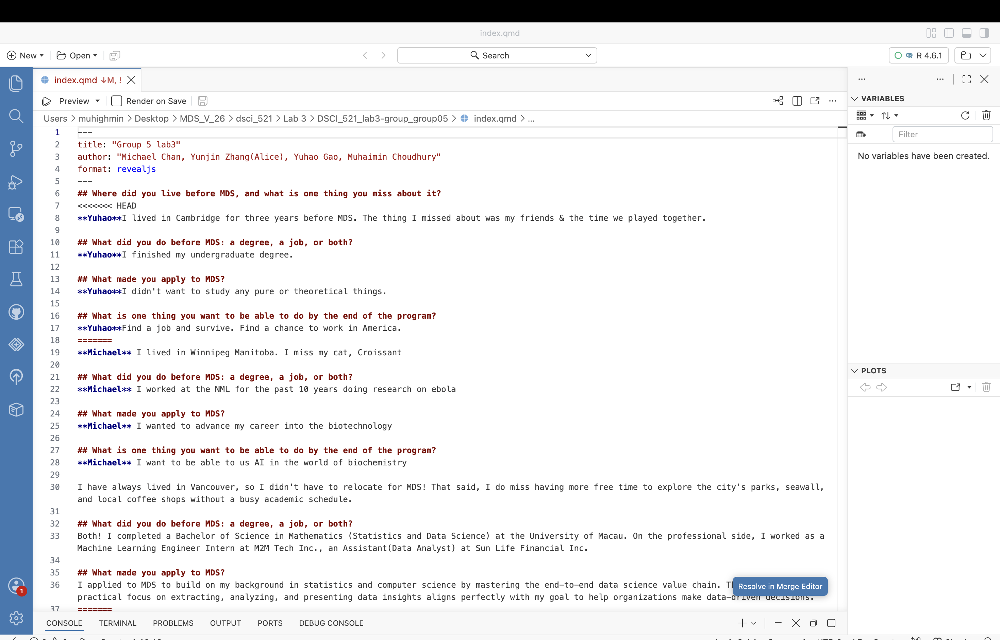
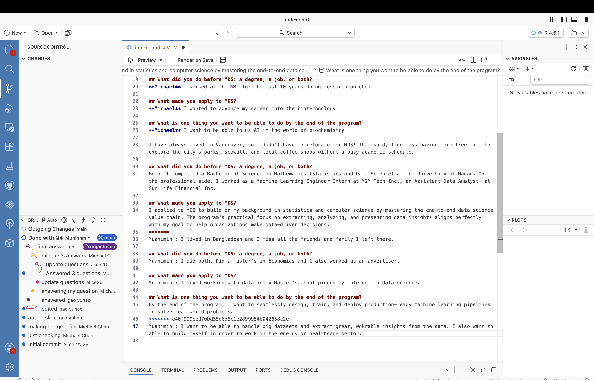
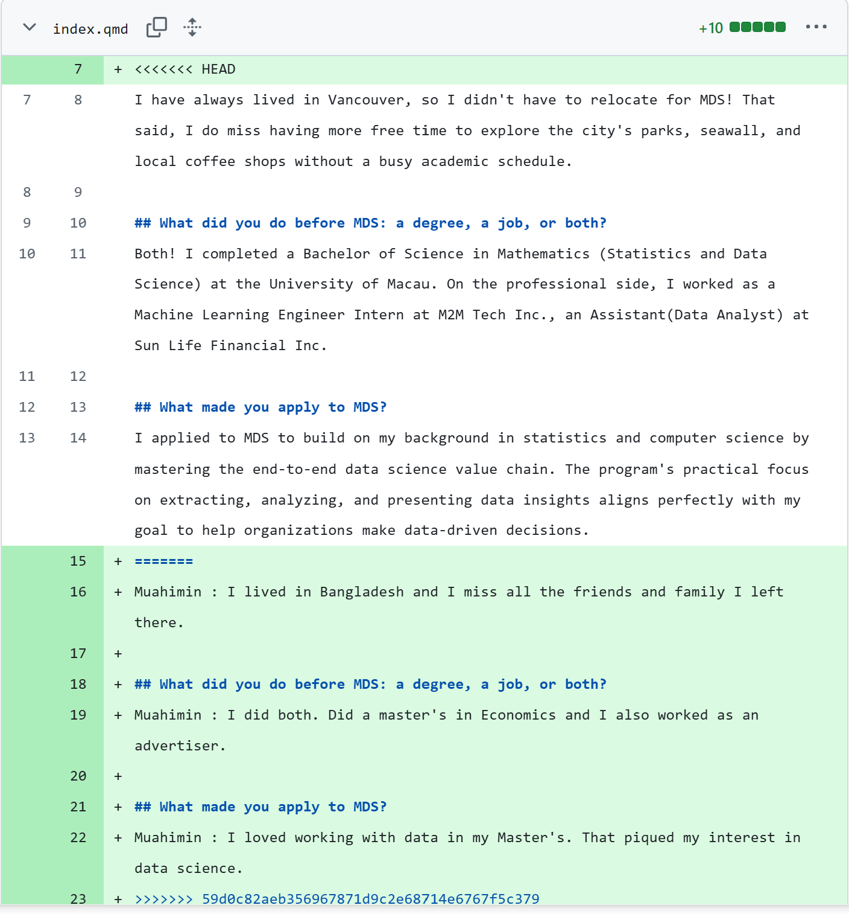

## Where did you live before MDS, and what is one thing you miss about it?
**Yuhao**I lived in Cambridge for three years before MDS. The thing I missed about was my friends & the time we played together.

**Michael** I lived in Winnipeg Manitoba. I miss my cat, Croissant 

**Muhaimin** I lived in Bangladesh and I miss all the friends and family I left there.

**Alice** I have always lived in Vancouver, so I didn't have to relocate for MDS! That said, I do miss having more free time to explore the city's parks, seawall, and local coffee shops without a busy academic schedule.

## What did you do before MDS: a degree, a job, or both?
**Yuhao** I finished my undergraduate degree.

**Michael** I worked at the NML for the past 10 years doing research on ebola

**Muhaimin** I did both. Did a master's in Economics and I also worked as an advertiser. 

**Alice** Both! I completed a Bachelor of Science in Mathematics (Statistics and Data Science) at the University of Macau. On the professional side, I worked as a Machine Learning Engineer Intern at M2M Tech Inc., an Assistant(Data Analyst) at Sun Life Financial Inc.

## What made you apply to MDS?
**Michael** I wanted to advance my career into the biotechnology

**Yuhao**I didn't want to study any pure or theoretical things.

**Muhaimin** I loved working with data in my Master's. That piqued my interest in data science.  

**Alice** I applied to MDS to build on my background in statistics and computer science by mastering the end-to-end data science value chain. The program's practical focus on extracting, analyzing, and presenting data insights aligns perfectly with my goal to help organizations make data-driven decisions.

## What is one thing you want to be able to do by the end of the program?
**Yuhao**Find a job and survive. Find a chance to work in America.

**Michael** I want to be able to us AI in the world of biochemistry

**Muhaimin** I want to be able to handle big datasets and extract great, wokrable insights from the data. I also want to able to build myself in order to work in the energy or healthcare sector.

**Alice** By the end of the program, I want to seamlessly design, train, and deploy production-ready machine learning pipelines to solve real-world problems.

## Michael Chan (mchan001)

## Ahmed Muhaimin Choudhury (muchou)
::: {layout-ncol=2}
 

:::

## Alice Zhang (alice26)
Note that in this repository Alice had used two GitHub accounts to commit and push, namely `alice26` (UBC account) and `AliceZYJ26` (Personal account).

::: {layout-ncol=2}

:::